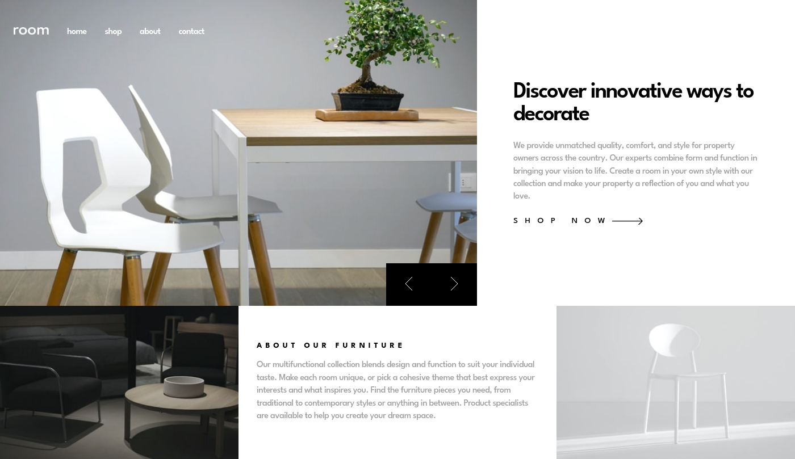

# Overview

This is a solution to the [Room homepage challenge on Frontend Mentor](https://www.frontendmentor.io/challenges/room-homepage-BtdBY_ENq).

The website was done using only Vanilla HTML, CSS, Javascript.

## Screenshot

## Link to Website (hosted with GitHub Pages)

- [Frontend Mentor Solution URL](https://www.frontendmentor.io/solutions/responsive-room-homepage-_pE3J6kJ_A)
- [Live Site URL - GitHub Pages](https://cristian-nastase.github.io/Room-homepage-master/)

## Author
- GitHub: https://github.com/Cristian-Nastase
- Frontend Mentor: https://www.frontendmentor.io/profile/Cristian-Nastase
